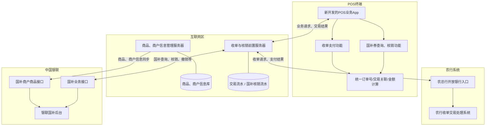

```mermaid
flowchart TB
    subgraph POS["POS终端"]
        APP["新开发的POS业务App"]
        PAY["收单支付功能"]
        SUB["国补券查询、核销功能"]
        BIND["统一订单号/交易关联/金额计算"]
        APP --> PAY
        APP --> SUB
        PAY --> BIND
        SUB --> BIND
    end

    subgraph INTERNET["互联网区"]
        direction TB
        MGT["商品、商户信息管理服务器"]
        PRE["收单与核销前置服务器"]
        DB1[("商品、商户信息库")]
        DB2[("交易流水 / 国补核销流水")]
        MGT --- DB1
        PRE --- DB2
    end

    subgraph ABC["农行系统"]
        OB["农总行开放银行入口"]
        ACQ["农行收单交易处理系统"]
        OB --> ACQ
    end

    subgraph UNION["中国银联"]
        UAPI1["国补商户商品接口"]
        UAPI2["国补业务接口"]
        UBG["银联国补后台"]
        UAPI1 --> UBG
        UAPI2 --> UBG
    end

    APP <-->|"业务请求、交易结果"| PRE
    MGT -->|"商品、商户信息同步"| UAPI1
    PRE <-->|"收单请求、支付结果"| OB
    PRE <-->|"国补查询、核销、撤销等"| UAPI2
```
